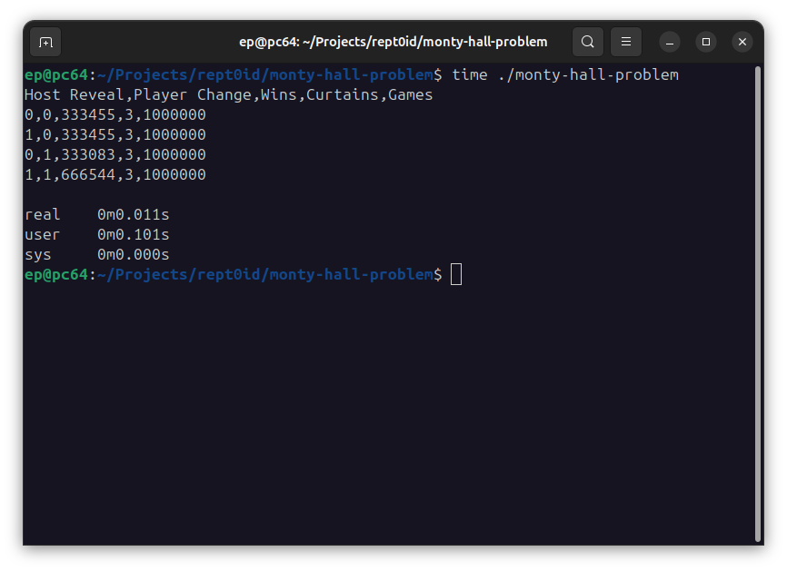

# monty-hall-problem



A simulation of the Monty Hall Problem.

From Wikipedia :

```
The Monty Hall problem is a brain teaser, in the form of a probability puzzle, based nominally on the American television game show Let's Make a Deal and named after its original host, Monty Hall.

[...]

It became famous as a question from reader Craig F. Whitaker's letter quoted in Marilyn vos Savant's "Ask Marilyn" column in Parade magazine in 1990:

"Suppose you're on a game show, and you're given the choice of three doors: Behind one door is a car; behind the others, goats. You pick a door, say No. 1, and the host, who knows what's behind the doors, opens another door, say No. 3, which has a goat. He then says to you, "Do you want to pick door No. 2?" Is it to your advantage to switch your choice?"

[...]

Savant's response was that the contestant should switch to the other door.

[...]

When the player first makes their choice, there is a ⁠2/3⁠ chance that the car is behind one of the doors not chosen. This probability does not change after the host reveals a goat behind one of the unchosen doors. When the host provides information about the two unchosen doors (revealing that one of them does not have the car behind it), the ⁠2/3⁠ chance of the car being behind one of the unchosen doors rests on the unchosen and unrevealed door, as opposed to the ⁠1/3⁠ chance of the car being behind the door the contestant chose initially.

[...]

**Paul Erdős, one of the most prolific mathematicians in history, remained unconvinced until he was shown a computer simulation demonstrating Savant's predicted result.**
```

## Build

```
make build
```

## Run

```
make run
```

or

```
./monty-hall-problem
```

Example Result :
```
Host Reveal,Player Change,Wins,Curtains,Games
0,0,333455,3,1000000
1,0,333455,3,1000000
0,1,333083,3,1000000
1,1,666544,3,1000000
```

Optional Flags :

`--log-no-header`:
- **Desc.**: Prints result without header.
- **Ex.**: `./monty-hall-problem --log-no-header`

`--curtains <NUMBER>`
- **Short**: `--c <NUMBER>`
- **Desc.**: Changes how many curtains there are.
- **Ex.**: `./monty-hall-problem --curtains 4`, `./monty-hall-problem --c 4`
- **Default** : 3

`--state-games <NUMBER>`
- **Short**: `--sg <NUMBER>`
- **Desc.**: Changes how many games (iterations/loops) per state (cases) there are.
- **Ex.**: `./monty-hall-problem --state-games 2000000`, `./monty-hall-problem --sg 2000000`
- **Default** : 1000000

## Memory-safety

This program, even written in C, tries to provide memory-safety, by using fixed-size stack arrays.

## Multiprocessing

This implementation uses **OpenMP** to parallelize the "games" in the simulation.

## Special Statistical Cases and Analysis of the Game

### A. No Reveal from Host

In the classic game, the player is asked about changing or not the picked curtain, right after the host reveals one of the curtains that doesn't have any prize.

In this implementation, there are two more cases, where the player changes or not the curtain, but the host doesn't reveal any curtain.

- Host doesn't reveal, player changes curtain
- Host doesn't revela, player doesn't change curtain

What the theory says is that, in the classic game, it's the host that enables the player to change his propabilities of winning. 

 - First, the player chooses one of the curtains => Propabilities of winning : 1/3
 - Then the host reveals one of the curtains without the prize
 - Now, the player knows one of the curtains that doesn't have the prize.
    - If the player changes the curtain, it's literally... a new game, where, the propabilities become 2/3. The new action, includes the knowledge on one of the curtains.
    - If not, the propabilites are as before, 1/3.

Turns out, by running the simulation, that if the host wouldn't reveal one of the curtains, the player changing curtain wouldn't have any impact.

The purpose of those two extra cases, is to prove the theoretical analysis above, that it's the host revealing one of the curtains that allows the player to enter a... new game with better chances of winning.

### B. More than 3 Curtains

This implementation allows the caller to optionally set the number of curtains. A number greater than 3 can be used. Less than 3 is not allowed (the player won’t have any curtain to change to).

An example follows below :
```
./monty-hall-problem --curtains 5
Host Reveal,Player Change,Wins,Curtains,Games
0,0,199953,5,1000000
1,0,199952,5,1000000
0,1,200206,5,1000000
1,1,266819,5,1000000

./monty-hall-problem --curtains 100
Host Reveal,Player Change,Wins,Curtains,Games
0,0,9862,100,1000000
1,0,9861,100,1000000
0,1,10012,100,1000000
1,1,10135,100,1000000
```

This proves that with more than 3 curtains, it's still always a good idea for the player to change curtain after the host reveals one.

But the more the curtains, the smaller the gain from changing.
