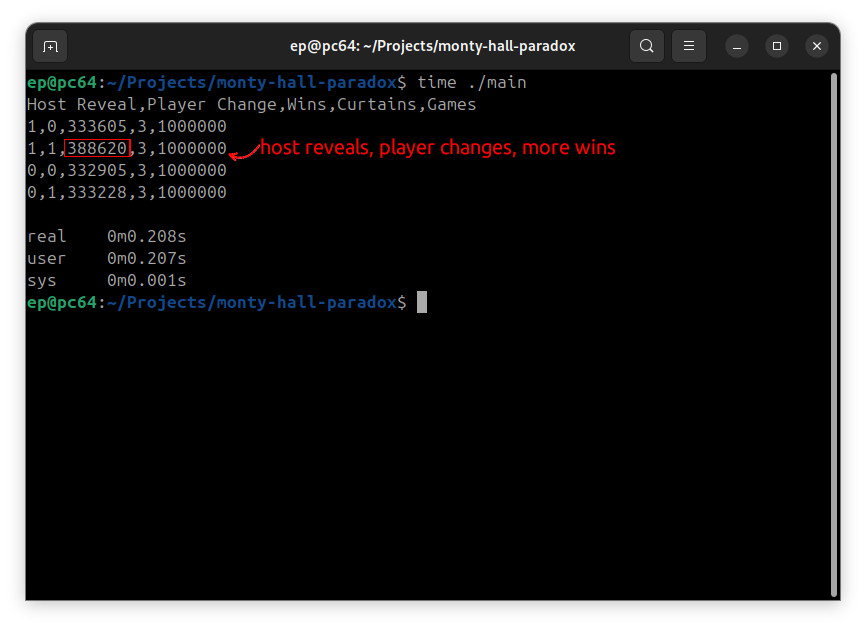

# monty-hall-paradox



## Build

```gcc main.c -o main```

## Run

```
> ./main
```

Example Result :
```
Host Reveal,Player Change,Wins,Curtains,Games
1,1,388689,3,1000000
0,1,332597,3,1000000
1,0,332888,3,1000000
0,1,332507,3,1000000
```

Optional Flags :
| Flag | Description | Example |
|--- |--- |--- |
| "--log-no-header" | Prints log without a header. | "./main --log-no-header" |
| "--curtains" (or "--c x") | Sets num of curtains Default is 3. | "./main --c 4". |
| "--state-games" (or "--sg x") | Sets num of games per state. Default is 1000000. | "./main --sg 100000" |

## Special Statistical Cases

Apart from the classic cases, this implementation also includes two additional cases:
- The host doesn't reveal any curtain, and the player keeps their chosen curtain. (Host Reveal=0,Player Change=0)
- The host doesn't reveal any curtain, and the player switches to the other curtain. (Host Reveal=0,Player Change=1)

What is common in both cases is that the host doesn't reveal any curtain.

The result of this, when you run the simulation, is that **if the host doesn't reveal a curtain, the player's chances of winning remain the same whether they change curtains or not**.

This differs from the classic game, where the host reveals one of the curtains, and if the player switches curtains, the player's chances of winning are higher.

## Multiprocessing

This implementation uses **OpenMP** to parallelize the "games" in the simulation, resulting in high performance.
