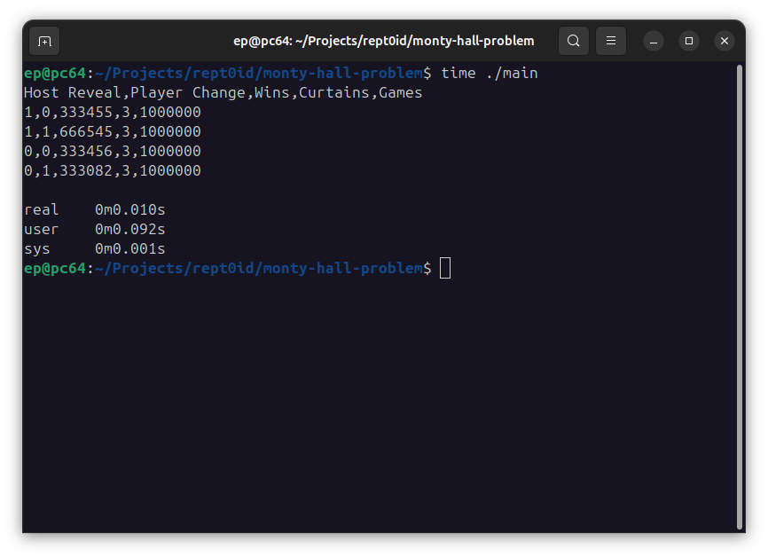

# monty-hall-problem



## Build

```gcc main.c -o main```

## Run

```
> ./main
```

Example Result :
```
Host Reveal,Player Change,Wins,Curtains,Games
1,0,333605,3,1000000
1,1,388620,3,1000000
0,0,332905,3,1000000
0,1,333228,3,1000000
```

Optional Flags :

`--log-no-header`:
- **Desc.**: Prints result without header.
- **Ex.**: `./main --log-no-header`

`--curtains <NUMBER>`
- **Short**: `--c <NUMBER>`
- **Desc.**: Changes how many curtains there are.
- **Ex.**: `./main --curtains 4`, `./main --c 4`
- **Default** : 3

`--state-games <NUMBER>`
- **Short**: `--sg <NUMBER>`
- **Desc.**: Changes how many games (iterations/loops) per state (cases) there are.
- **Ex.**: `./main --state-games 2000000`, `./main --sg 2000000`
- **Default** : 1000000

## Special Statistical Cases

Apart from the classic cases, this implementation also includes two additional cases:
- The host doesn't reveal any curtain, and the player keeps their chosen curtain. (Host Reveal=0,Player Change=0)
- The host doesn't reveal any curtain, and the player switches to the other curtain. (Host Reveal=0,Player Change=1)

What is common in both cases is that the host doesn't reveal any curtain.

The result of this, when you run the simulation, is that **if the host doesn't reveal a curtain, the player's chances of winning remain the same whether they change curtains or not**.

This differs from the classic game, where the host reveals one of the curtains, and if the player switches curtains, the player's chances of winning are higher.

## Multiprocessing

This implementation uses **OpenMP** to parallelize the "games" in the simulation.
